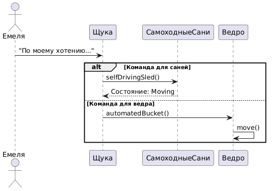

# Sequence Diagram: По Щучьему Велению

---

## 1. Краткое описание
Диаграмма последовательности иллюстрирует взаимодействие между **Емелей**, **Щукой**, **Самоходными Санями** и **Ведром**. Емеля отправляет команду Щуке, которая в зависимости от типа команды активирует либо Самоходные Сани, либо Ведро.

---

## 2. Участники
   Участник          | Описание                                      |
 |-------------------|-----------------------------------------------|
 | Емеля             | Главный герой, отправляет команды Щуке.      |
 | Щука              | Волшебная щука, исполняет команды Емели.      |
 | СамоходныеСани    | Объект, который начинает движение по команде. |
 | Ведро             | Объект, который автоматически наполняется.     |

---

## 3. Основной сценарий

### 3.1 Емеля отправляет команду
- **Сообщение:** `"По моему хотению..."`
- **Отправитель:** Емеля
- **Получатель:** Щука
- **Описание:** Емеля произносит заклинание и отправляет команду Щуке.

---

### 3.2 Разбор команды Щукой

#### 3.2.1 Команда для саней
- **Условие:** Команда предназначена для Самоходных Саней.
- **Действия:**
  1. **Сообщение:** `selfDrivingSled()`
     - **Отправитель:** Щука
     - **Получатель:** СамоходныеСани
  2. **Ответ:** `Состояние: Moving`
     - **Отправитель:** СамоходныеСани
     - **Получатель:** Щука

#### 3.2.2 Команда для ведра
- **Условие:** Команда

