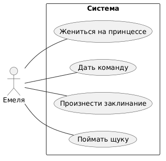

# Use Case: По Щучьему Велению

## 1. Краткое описание
Актёр **Емеля** взаимодействует с системой, чтобы выполнить ряд действий: поймать щуку, произнести заклинание, дать команду и жениться на принцессе.

---

## 2. Актёры
   Актёр       | Описание                          |
 |-------------|-----------------------------------|
 | Емеля       | Главный герой сказки, который выполняет основные действия. |

---

## 3. Варианты использования

### 3.1 Поймать щуку
- **Описание:** Емеля ловит волшебную щуку, которая является ключом к выполнению его желаний.
- **Основной поток:**
  1. Емеля идёт на речку.
  2. Емеля ловит щуку.
- **Альтернативный поток:** Если щука не клюёт, Емеля повторяет попытку.

### 3.2 Произнести заклинание
- **Описание:** Емеля произносит заклинание, чтобы активировать волшебные свойства щуки.
- **Основной поток:**
  1. Емеля держит щуку в руках.
  2. Емеля произносит заклинание: "По щучьему велению, по моему хотению".
- **Альтернативный поток:** Если заклинание произнесено неправильно, щука не реагирует.

### 3.3 Дать команду
- **Описание:** Емеля даёт команду щуке, чтобы выполнить его желание.
- **Основной поток:**
  1. Емеля формулирует команду (например, "Ездите, санки, сами").
  2. Щука исполняет команду.
- **Альтернативный поток:** Если команда некорректна, щука просит уточнить.

### 3.4 Жениться на принцессе
- **Описание:** Емеля использует волшебные способности щуки, чтобы жениться на принцессе.
- **Основной поток:**
  1. Емеля формулирует желание жениться на принцессе.
  2. Щука исполняет желание, и Емеля женится на принцессе.
- **Альтернативный поток:** Если принцесса отказывается, щука помогает убедить её.

---
## Диаграмма



## 4. Диаграмма вариантов использования
```plantuml
@startuml UseCase_ПоЩучьемуВелению

left to right direction

actor Емеля as emelya

rectangle Система {
  emelya -- (Поймать щуку)
  emelya -- (Произнести заклинание)
  emelya -- (Дать команду)
  emelya -- (Жениться на принцессе)
}

@enduml
